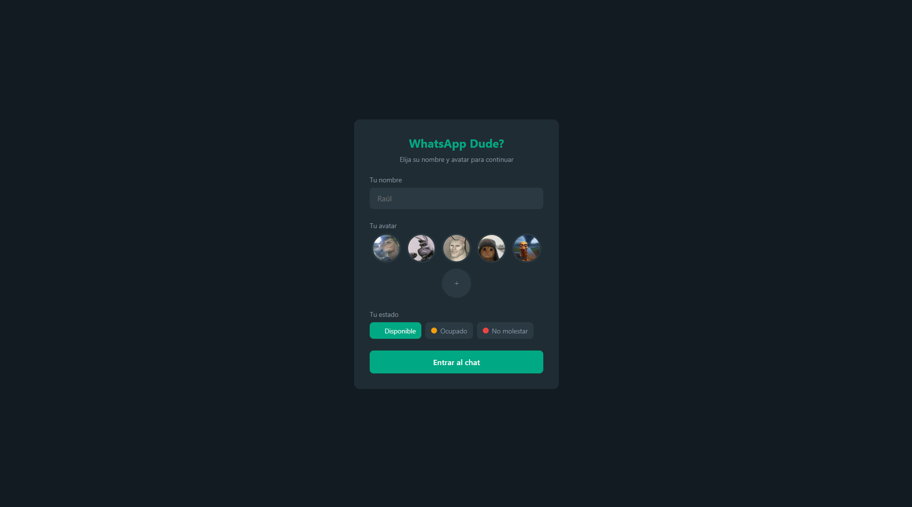
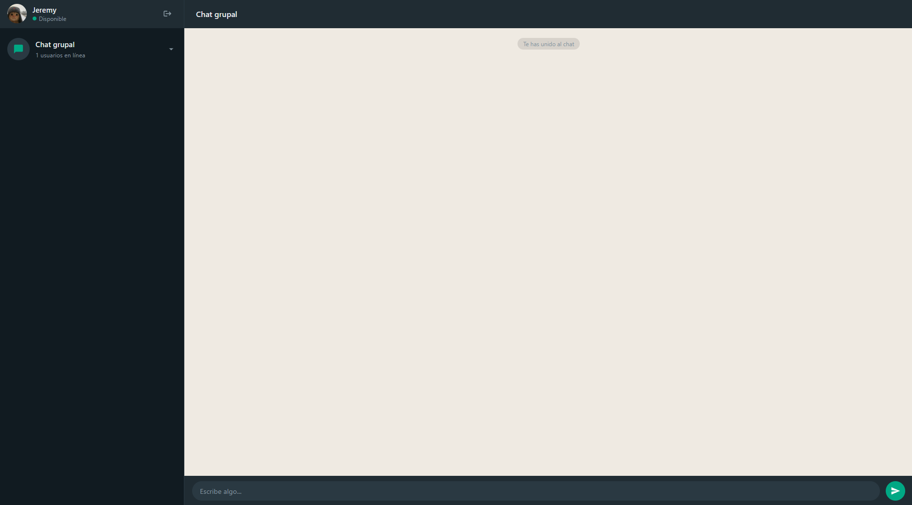

# WhatsApp Dude? 💬 

LINK PRODUCCIÓN: https://whatsappclone-frontend-3rat.onrender.com

Clon de WhatsApp Web desarrollado como proyecto de clase. Permite a varios usuarios conectarse en tiempo real y chatear en una sala común.

## 🌐 URL en producción
https://whatsappclone-frontend-3rat.onrender.com

---

## 🛠️ Tecnologías utilizadas

### Frontend
- **Vue 3** — Framework de JavaScript para construir la interfaz por componentes
- **Vue Router** — Para gestionar la navegación entre el login y el chat
- **Socket.io client** — Para la comunicación en tiempo real con el servidor
- **Supabase** — Para subir y almacenar las fotos de perfil personalizadas

### Backend
- **Node.js** — Entorno de ejecución del servidor
- **Express** — Framework para crear el servidor HTTP
- **Socket.io** — Para gestionar la comunicación en tiempo real entre usuarios

---

## ⚙️ ¿Cómo funciona?

### Login
Al entrar a la app, el usuario debe identificarse con:
- Un **nombre** de usuario
- Un **avatar**, que puede ser una de las imágenes predefinidas o una foto propia subida desde su dispositivo
- Un **estado** (Disponible, Ocupado o No molestar)

Sin identificarse no se puede acceder al chat.

### Chat
Una vez dentro, el usuario entra automáticamente a la **sala común** donde están todos los conectados. Desde ahí puede:
- **Enviar y recibir mensajes** en tiempo real
- Ver **quién está escribiendo** en cada momento
- Recibir **avisos** cuando alguien entra o sale del chat
- Ver la **lista de usuarios conectados** en el panel izquierdo
- Usar la **flecha** para volver al último mensaje si ha hecho scroll hacia arriba
- **Cerrar sesión** para volver al login y entrar con otra cuenta

### Comunicación en tiempo real
Toda la comunicación entre usuarios se hace a través de **WebSockets** con Socket.io. Cuando un usuario envía un mensaje, el servidor lo recibe y lo reenvía al resto de usuarios conectados de forma instantánea, sin necesidad de recargar la página.

---

## 📁 Estructura del proyecto
WhatsAppClone/
├── backend/         # Servidor Node.js + Express + Socket.io
│   └── server.js
└── frontend/        # Cliente Vue 3
└── src/
├── components/   # Componentes de la interfaz
├── router/       # Configuración de rutas
├── socket/       # Configuración de Socket.io
└── supabase/     # Configuración de Supabase

---

## 🚀 Ejecutar en local

### Backend
```bash
cd backend
npm install
node server.js
```

### Frontend
```bash
cd frontend
npm install
npm run dev
```

## Capturas de la app


